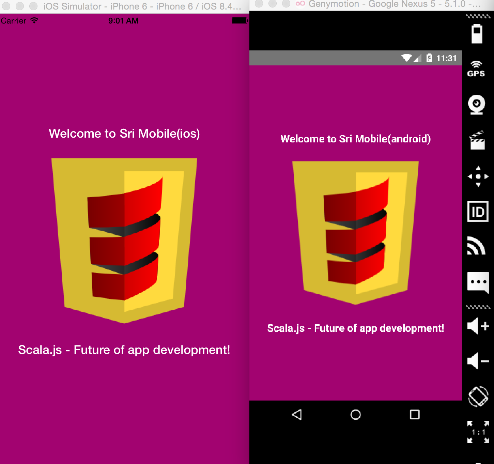

# Sri Mobile Template

Sri mobile app skeleton




# How To Run

```scala

 sbt ~fullOptMobile
   
     or 
 
 sbt ~fastOptMobile ( make sure you have this one line fix : https://github.com/facebook/react-native/pull/4830/files )
 
 // this will generate index.ios.js and index.android.js files
 
```

### React Native Playground

1) go to https://rnplay.org/ ->  Signin  -> NewApp -> name it as `SriMobileTemplate`

2) Replace content of index.io.js and index.android.js files with content from files that are generated using sbt ~fullOptMobile

### Simulator/Device

-> Install Node.js 4.0 or greater using [nvm](https://github.com/creationix/nvm#installation)

```

sbt ~fullOptMobile
//open new  terminal
npm install
npm start
```

#### Mac

-> `brew install watchman`

-> `npm install -g react-native-cli`

**iOS**

`react-native run-ios`

or

Open  `ios/SriMobileTemplate.xcodeproj` in xcode(> 6.3) and hit the run button.

**Android**

Follow this guide : https://facebook.github.io/react-native/docs/android-setup.html

run `react-native run-android`

#### Windows and Linux

http://suyogkc.com.np/react-native-for-windowslinux/